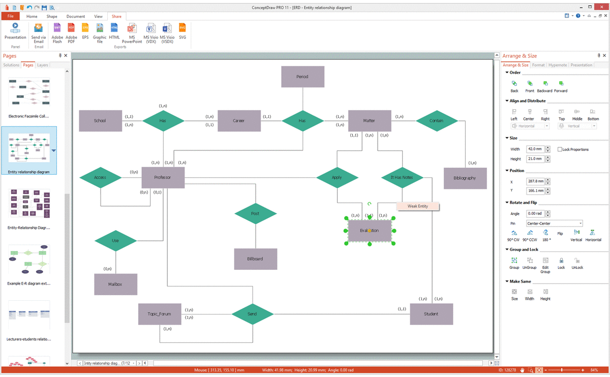

# Database for an Online Shop

In this project, I conducted an analysis of several online shops to identify the specific data requirements for their respective databases.
Following this, I provided a concise description of the targeted database management system (DBMS) environment. Subsequently,
I extracted entities and their relationships from this environmental description and constructed an Entity-Relationship (ER) diagram. 
Afterward, I identified and normalized tables up to the Boyce-Codd Normal Form (BCNF) based on the ER diagram. 
These normalized tables were implemented in DataGrip using MySQL, and data was populated within them. 
Additionally, I designed and implemented views, triggers, functions, and stored procedures as part of this project.
